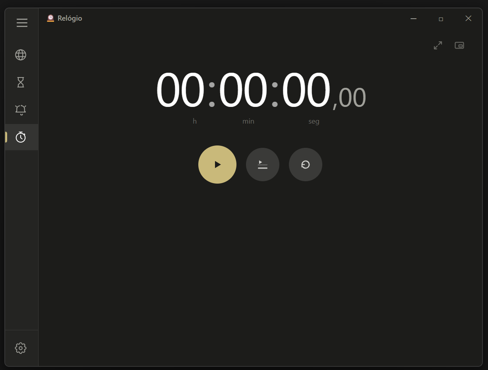
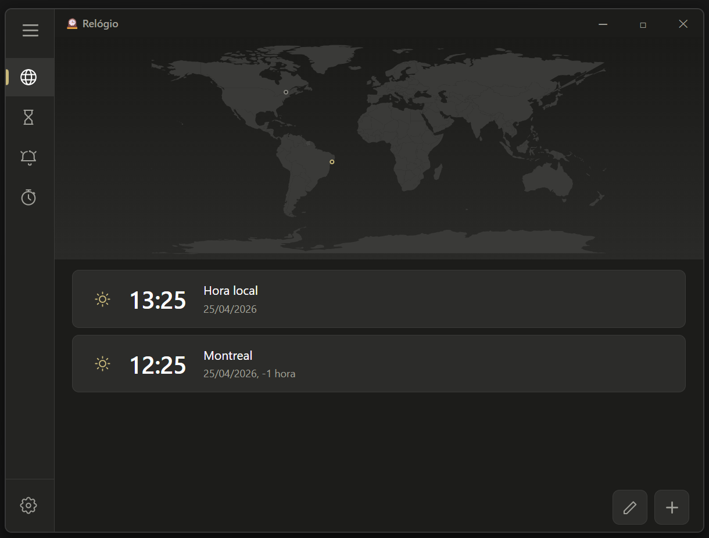
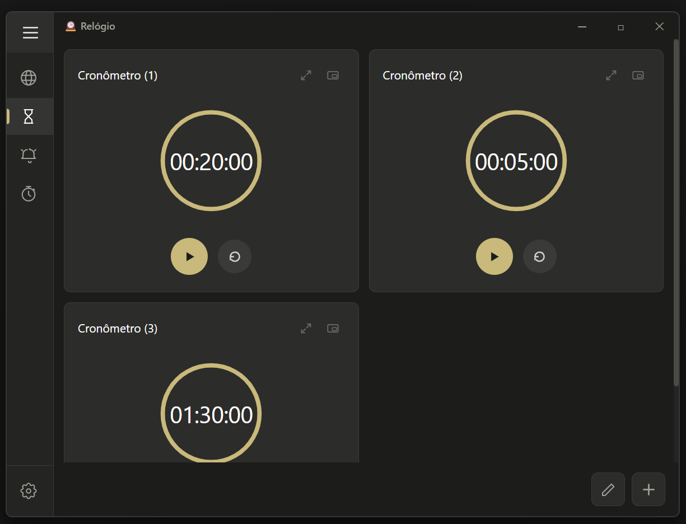
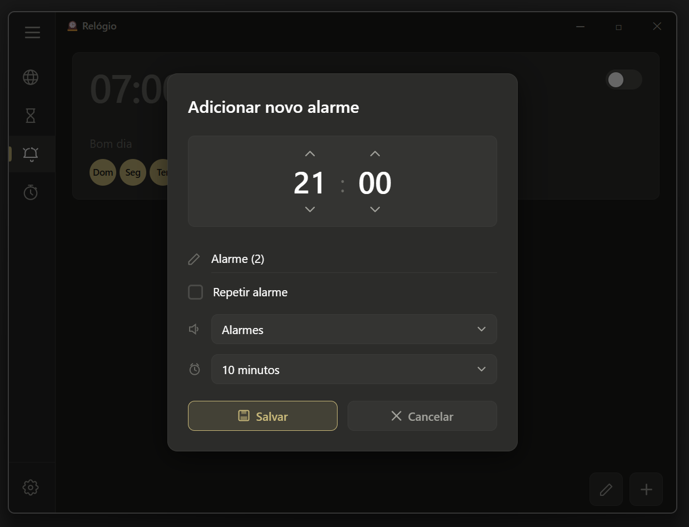
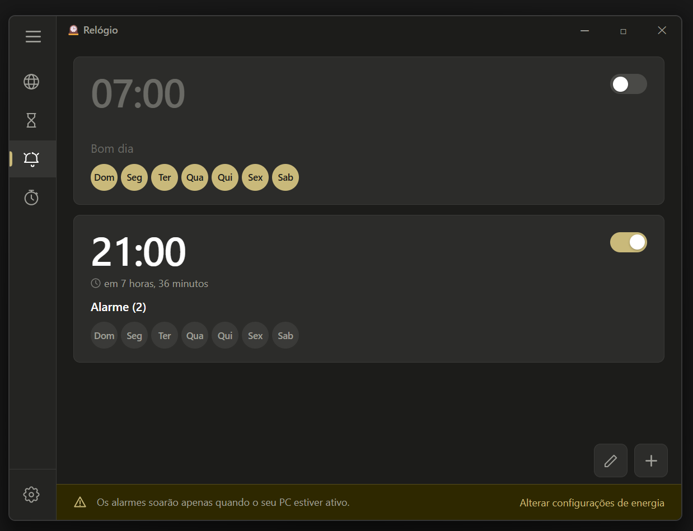
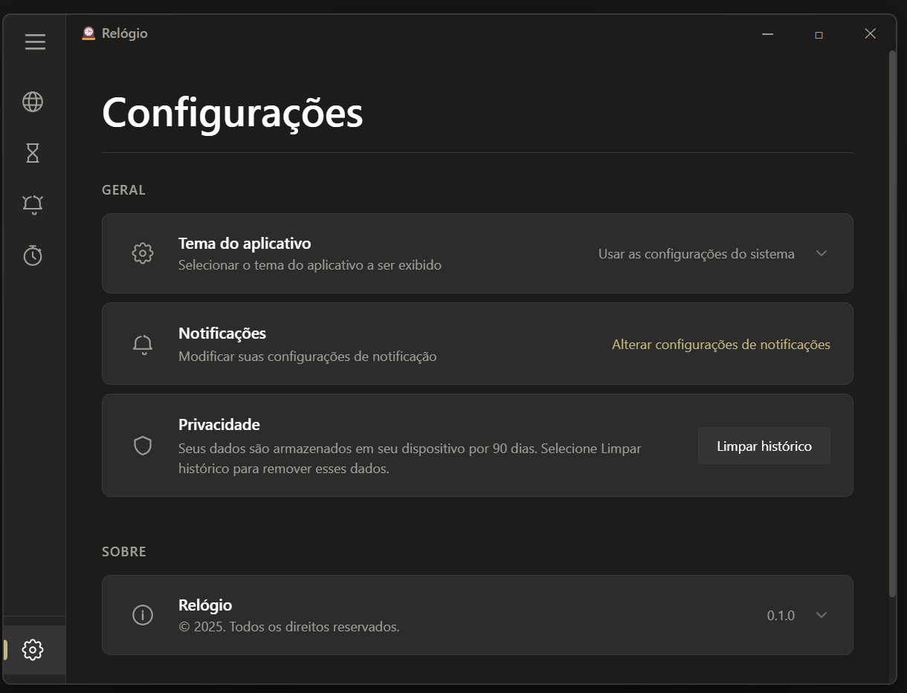
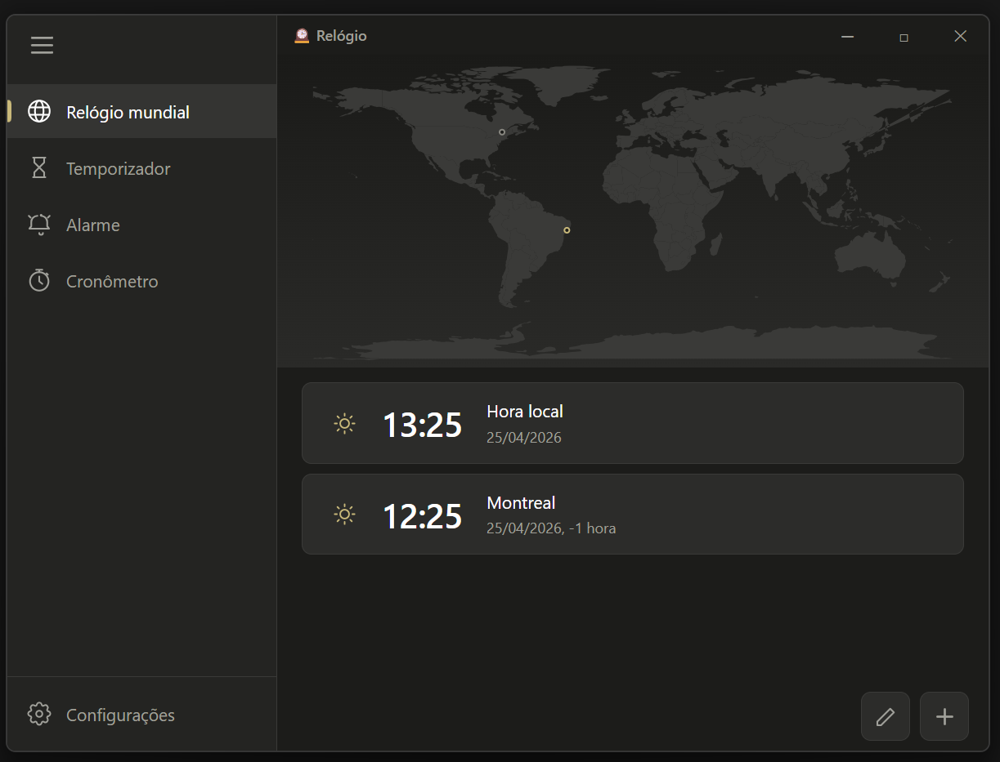

# 🕐 clockClone

Clone do app **Relógio do Windows 11** desenvolvido com **Rust + Tauri** e **HTML + CSS + JavaScript**.

## 📸 Screenshots









---

## 📦 Módulos

| Módulo | Descrição |
|--------|-----------|
| 🌍 **Relógio Mundial** | Mapa SVG interativo com cidades, fusos horários e pins de localização |
| ⏱️ **Temporizador** | Múltiplos timers simultâneos com anel SVG animado, modo expandido e PiP |
| ⏰ **Alarme** | Alarmes com dias da semana, som, soneca e modal visual completo |
| ⏲️ **Cronômetro** | Contador com voltas, labels mais rápida/lenta, modo expandido e PiP |
| ⚙️ **Configurações** | Tema claro/escuro/sistema, notificações, privacidade e sobre |

---

## ✨ Funcionalidades

- **Titlebar customizada** com botões minimizar, maximizar e fechar
- **Sidebar expansível** com hambúrguer, ícones e labels animados
- **Modo PiP (Picture-in-Picture)** no Temporizador e Cronômetro — flutua sobre outras janelas
- **Modo expandido** no Temporizador e Cronômetro — ocupa a janela inteira
- **Notificações nativas** do Windows ao fim de timers e alarmes
- **Sons nativos** ao fim de timers e alarmes via `rodio`
- **Tema claro/escuro/sistema** com detecção automática de `prefers-color-scheme`
- **Mapa SVG** renderizado com `world-atlas` + `topojson-client`
- **Ícone personalizado** no Explorer e na barra de tarefas

---

## 🚀 Como rodar

### Pré-requisitos

- **Windows 10/11**
- **Rust** — instale em [rustup.rs](https://rustup.rs)
- **Node.js** 18+ — instale em [nodejs.org](https://nodejs.org)

### Instalação

```bash
# Clone o repositório
git clone https://github.com/R0ch-a/clockClone.git
cd clockClone

# Instale as dependências JavaScript
npm install
```

### Desenvolvimento

Abra **dois terminais** na pasta do projeto:

```bash
# Terminal 1 — servidor Vite
npm run dev

# Terminal 2 — app Tauri
cargo tauri dev
```

### Build

```bash
cargo tauri build
```

O instalador `.exe` será gerado em:
```
src-tauri/target/release/bundle/nsis/clockclone_1.0.0_x64-setup.exe
```

---

## 🧪 Testes

### JavaScript (Vitest) — 202 casos

```bash
npm test
```

| Arquivo | Casos |
|---------|-------|
| `timer.test.js` | 37 |
| `stopwatch.test.js` | 34 |
| `world-clock.test.js` | 38 |
| `alarm.test.js` | 47 |
| `settings.test.js` | 46 |

### Rust (cargo test) — 31 casos

```bash
cd src-tauri
cargo test
```

---

## 🗂️ Estrutura do projeto

```
clockClone/
├── src/                    # Frontend
│   ├── index.html          # Estrutura completa do app
│   ├── style/              # CSS por módulo
│   └── js/                 # Lógica por módulo
│       ├── router.js       # Navegação e controles da janela
│       ├── tauri-bridge.js # Wrapper centralizado das APIs Tauri
│       ├── world-clock.js  # Relógio Mundial
│       ├── timer.js        # Temporizador
│       ├── alarm.js        # Alarme
│       ├── stopwatch.js    # Cronômetro
│       └── settings.js     # Configurações
├── src-tauri/              # Backend Rust
│   ├── src/
│   │   ├── main.rs         # Entrada do app
│   │   ├── commands.rs     # Comandos Tauri (invoke)
│   │   ├── state.rs        # Modelos de dados
│   │   ├── alarm_scheduler.rs # Thread de alarmes
│   │   └── audio.rs        # Reprodução de sons
│   ├── sounds/             # Sons .mp3 embutidos
│   └── icons/              # Ícones do app
├── tests/
│   ├── unit/               # Testes JavaScript
│   └── rust/               # Testes Rust
└── docs/                   # Documentação técnica
```

---

## 🛠️ Stack

| Camada | Tecnologia |
|--------|-----------|
| Frontend | HTML5, CSS3, JavaScript (ES Modules) |
| Bundler | Vite 8.x |
| Backend | Rust 1.77+ + Tauri 2.x |
| Áudio | rodio 0.19 |
| Mapa | world-atlas + topojson-client |
| Persistência | tauri-plugin-store |
| Notificações | tauri-plugin-notification |
| Testes JS | Vitest |
| Testes Rust | cargo test |

---

## 📄 Documentação

A documentação completa está na pasta [`docs/`](./docs/):

- [`plano-projeto-relogio-win11.md`](./docs/plano-projeto-relogio-win11.md) — Plano de projeto com requisitos e arquitetura
- [`documentacao-tecnica.md`](./docs/documentacao-tecnica.md) — Documentação técnica de implementação

---

## 👤 Autor

**Rafael Rocha**  
GitHub: [@R0ch-a](https://github.com/R0ch-a)

---

## 📝 Licença

Este projeto é um clone desenvolvido para fins educacionais.  
O design original pertence à **Microsoft Corporation**.
